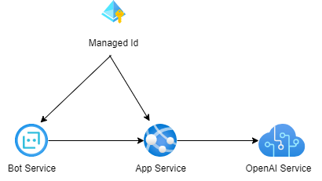

# AOAI Teams ChatBot デモアプリ

AOAI (Azure OpenAI Service) の ChatGPT を使った Teams 向け Bot Service アプリです。

## システム構成

本デモ環境は以下のような環境を想定。



- すべてPublicに配置されたリソース。
- Bot Service
    - Teams チャンネルを作成
- App Service
    - Linux
    - Node.js v16
- OpenAI Service
    - ChatGPT 3.5 turbo
    - `chat completions` API 利用

## フォルダ構成

フォルダは以下の通り。

```
- aoai-chatbot    。 Node.js v16
- teams-app-pkg   Teamsアプリ展開用のひな形

├───aoai-chatbot                                // BotServiceアプリ本体（=AppServiceで動作するアプリ）
│   ├───deploymentTemplates
│   └───resouces
│
├───teams-app-pkg                               // Teamsアプリ展開用のひな形
│       bot-icon-large.png
│       bot-icon-small.png
│       manifest.json.sample
│
└───docs
```


## 環境変数

AppService（ `aoai-chatbot` ）が必要な環境変数は以下の通り。

| name | value |
|---|---|
| `MicrosoftAppType` | `UserAssignedMSI` 固定 |
| `MicrosoftAppId` | ユーザー割り当てマネージド ID のクライアント ID。 |
| `MicrosoftAppPassword` | （空欄） |
| `MicrosoftAppTenantId` | ユーザー割り当てマネージド ID のテナント ID。 |
| `ENDPOINT` | OpenAI Service の エンドポイント |
| `DEPLOYMENT_NAME` | OpenAI Service の利用したい モデルデプロイ名 |
| `API_KEY` | OpenAI Service のアクセスキー |

**ローカル実行する場合** 

`/aoai-chatbot/.env` ファイルを作成。
BotService用の以下の環境変数は不要なので空欄のままにする。

* MicrosoftAppType
* MicrosoftAppId
* MicrosoftAppPassword
* MicrosoftAppTenantId

**AppServiceへ登録する場合**

`MicrosoftAppPassword` 以外は適切な値を設定する。

